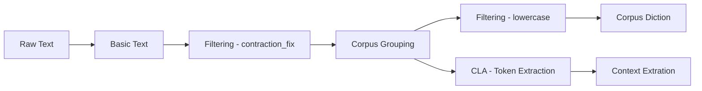

# Parry's Processing Domain

Read more about Parry's Domain: [Daytime (6AM-6PM EST)](https://kamutiv.com/nlp/processing) or [Nighttime (6PM-6AM EST)](https://kamutiv.com/processing.html).

## Features

### Sense Appraisal and Attribute derivation

- `Basic Text` (supported)
- `Speech Audio` (unsupported, planned for future)
- `Visual (Text)` (unsupported, planned for future)
- `Visual (Everything else)` (unsupported, plannded for future)
- `Touch` (unsupported, unplanned)
- `Taste` (unsupported, unplanned)
- `Smell` (unsupported, unplanned)

### Corpus Linguistics Analysis (CLA)

- Representation of the quantitative measures used in the field of corpus linguistics

### Filtering Algorithms

- Basic filtering techniques to normalize input

### HCI (Human Computer Interaction)

- Helper functions to interface the application with humans

### Statistics Functions

- Basic statistics functions for probabilistic analysis and data modeling

### Storage Options

- Helper functions to save data for large-scale applications

## Use cases

### Basic Text Input

