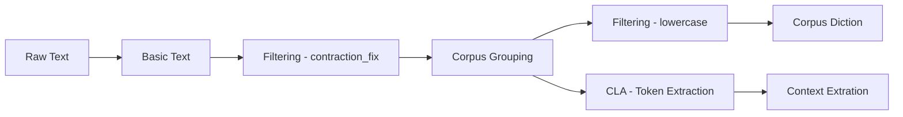
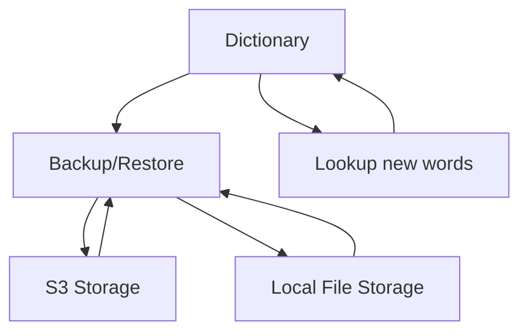

# Parry's Processing Domain

Read more about Parry's Domain: [Daytime (6AM-6PM EST)](https://kamutiv.com/nlp/processing) or [Nighttime (6PM-6AM EST)](https://kamutiv.com/processing.html).

## Features

### Sense Appraisal and Attribute derivation

- `Basic Text` (supported)
- `Speech Audio` (unsupported, planned for future)
- `Visual (Text)` (unsupported, planned for future)
- `Visual (Everything else)` (unsupported, plannded for future)
- `Touch` (unsupported, unplanned)
- `Taste` (unsupported, unplanned)
- `Smell` (unsupported, unplanned)

### Corpus Linguistics Analysis (CLA)

- Representation of the quantitative measures used in the field of corpus linguistics

### Filtering Algorithms

- Basic filtering techniques to normalize input

### HCI (Human Computer Interaction)

- Helper functions to interface the application with humans

### Statistics Functions

- Basic statistics functions for probabilistic analysis and data modeling

### Storage Options

- Helper functions to save data for large-scale applications

## Use cases

### Basic Text Input



### Dictionary



## Major Structures

### Basic Text

```python
class BasicText():
    self.text = str(full_text)
    self.groups = dict(str(context_id): list(str(context)))
    self.words = list(str)
    self.contexts = dict(word: list((str(context), str(context_id), int(location)))
```

### Dictionary

```python
class LocalDictionary():
    self.dictionary = dict(word: dict(entry: (definition from wsd), timestamp: (age)))
    self.lookup_delay = int(time to delay between definition lookups)
    def prepopulate():
        # Given a list of words, do a mass lookup of all the words
    def backup():
        # Call Parent Storage class Backup function
    def restore():
        # Call Parent Storage class Restore function
    def lookup():
        # Look up word if not in dictionary or if current definition is too old
    def numberOfSenses():
        # Get the number of definitions for a word
```

### Storage

```python
class LocalStorage():
    self.save = (variable to save)
    def backup():
        # Open File and pickle variable
    def restore():
        # Open File and unpickle variable

class S3Storage():
    self.bucket_name = (S3 bucket name)
    self.session = (AWS S3 Connection)
    self.save = (variable to save)
    def backup():
        # Pickle variable to fileobj and upload to S3
    def restore():
        # Download fileobj from S3 and unpickle variable
```
